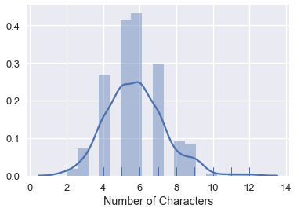

# 一、数据科学的生命周期

在数据科学中，我们使用大量不同的数据集来对世界做出结论。在这个课程中，我们将通过计算和推理思维的双重视角，来讨论数据科学的关键原理和技术。实际上，这涉及以下过程：

+   提出一个问题
+   获取和清理数据
+   进行探索性数据分析
+   用预测和推理得出结论

在这个过程的最后一步之后，通常出现更多的问题，因此我们可以反复地执行这个过程，来发现我们的世界的新特征。这个正反馈的循环对我们的工作至关重要，我们称之为数据科学生命周期。

如果数据科学的生命周期与它说的一样容易进行，那么就不需要该主题的教科书了。幸运的是，生命周期中的每个步骤都包含众多挑战，这些挑战揭示了强大和通常令人惊讶的见解，它们构成了使用数据在思考后进行决策的基础。

和 Data8 一样，我们将以一个例子开始。

> 译者注：Data8 是 DS100 是先修课。我之前翻译了它的课本，[《计算与推断思维 中文版》](https://github.com/Kivy-CN/data8-textbook-zh)。

## 关于本书

在我们继续之前，重要的是说出我们对读者的假设。

在本书中，我们将当作你已经上完了 Data8 或者其他一些类似的东西。 特别是，我们假定您对以下主题有一定了解（同时给出 Data8 课本的页面链接）。

+   [表格数据处理：选择，过滤，分组，连接](https://github.com/Kivy-CN/data8-textbook-zh/blob/master/5.md)
+   [抽样，统计的经验分布](https://github.com/Kivy-CN/data8-textbook-zh/blob/master/9.md)
+   [使用自举重采样的假设检验](https://github.com/Kivy-CN/data8-textbook-zh/blob/master/10.md)
+   [最小二乘回归和回归推断](https://github.com/Kivy-CN/data8-textbook-zh/blob/master/14.md)
+   [分类](https://github.com/Kivy-CN/data8-textbook-zh/blob/master/15.md)

另外，我们假设你已经上完了 CS61A 或者其他类似的东西，因此除了特殊情况外，不会解释 Python 的语法。

> 译者注：CS61A（SICP Python）是计算机科学的第一门课，中文版讲义请见[《SICP Python 中文版》](https://github.com/Kivy-CN/sicp-py-zh)。

## DS100 的学生

回想一下，数据科学生命周期涉及以下广泛的步骤：

+   问题表述：
    +   我们想知道什么，或者我们想要解决什么问题？
    +   我们的假设是什么？
    +   我们的成功指标是什么？
+   数据采集和清洗：
    +   我们有什么数据以及需要哪些数据？
    +   我们将如何收集更多数据？
    +   我们如何组织数据来分析？
+   探索性数据分析：
    +   我们是否有了相关数据？
    +   数据有哪些偏差，异常或其他问题？
    +   我们如何转换数据来实现有效的分析？
+   预测和推断：
    +   这些数据说了世界的什么事情？
    +   它回答我们的问题，还是准确地解决问题？
    +   我们的结论有多健壮？

### 问题表述

我们想知道 DS100 中的学生姓名的数据，是否向我们提供了学生本身的其他信息。 虽然这是一个模糊的问题，但这足以让我们处理我们的数据，我们当然可以在问题变得更加精确的时候提出问题。

### 数据采集和清洗

在 DS100 中，我们将研究收集数据的各种方法。

我们首先看看我们的数据，这是我们从以前的 DS100 课程中下载的学生姓名的名单。

如果您现在不了解代码，请不要担心；我们稍后会更深入地介绍这些库。 相反，请关注我们展示的流程和图表。

```py
import pandas as pd

students = pd.read_csv('roster.csv')
students
```

|  | Name | Role |
| --- | --- | --- |
| 0 | Keeley | Student |
| 1 | John | Student |
| 2 | BRYAN | Student |
| ... | ... | ... |
| 276 | Ernesto | Waitlist Student |
| 277 | Athan | Waitlist Student |
| 278 | Michael | Waitlist Student |

279 行 × 2 列

我们很快可以看到，数据中有一些奇怪的东西。 例如，其中一个学生的姓名全部是大写字母。 另外，`Role`列的作用并不明显。

在 DS100 中，我们将研究如何识别数据中的异常并执行修正。 大写字母的差异将导致我们的程序认为`'BRYAN'`和`'Bryan'`是不同的名称，但他们对于我们的目标是相同的。 我们将所有名称转换为小写来避免这种情况。

```py
students['Name'] = students['Name'].str.lower()
students
```


| | Name | Role |
| --- | --- | --- |
| 0 | keeley | Student |
| 1 | john | Student |
| 2 | bryan | Student |
| ... | ... | ... |
| 276 | ernesto | Waitlist Student |
| 277 | athan | Waitlist Student |
| 278 | michael | Waitlist Student |

279 行 × 2 列

现在我们的数据有了更容易处理的格式，我们继续进行探索性数据分析。

## 探索性数据分析（EDA）

术语探索性数据分析（简称EDA）是指发现我们的数据特征的过程，这些特征为未来的分析提供信息。

这是上一页的`students`表：

```py
students
```

| | Name | Role |
| --- | --- | --- |
| 0 | keeley | Student |
| 1 | john | Student |
| 2 | bryan | Student |
| ... | ... | ... |
| 276 | ernesto | Waitlist Student |
| 277 | athan | Waitlist Student |
| 278 | michael | Waitlist Student |

279 行 × 2 列

我们留下了许多问题。 这个名单中有多少名学生？ `Role`列是什么意思？ 我们进行 EDA 来更全面地了解我们的数据。

在 DS100 中，我们将研究探索性数据分析和实践，来分析新数据集。

通常，我们通过重复提出简单问题，他们有关我们想知道的数据，来探索数据。 我们将以这种方式构建我们的分析。

我们的数据集中有多少学生？

```py
print("There are", len(students), "students on the roster.")
# There are 279 students on the roster.
```

一个自然的后续问题是，这是否是完整的学生名单。 在这种情况下，我们碰巧知道这个列表包含班级中的所有学生。

`Role`字段的含义是什么？

理解字段的含义，通常可以通过查看字段数据的唯一值来实现：

```py
students['Role'].value_counts().to_frame()
```


| | Role |
| --- | --- |
| Student | 237 |
| Waitlist Student | 42 |

我们可以在这里看到，我们的数据不仅包含当时注册了课程的学生，还包含等候名单上的学生。 `Role`列告诉我们每个学生是否注册。

那名字呢？ 我们如何总结这个字段？

在 DS100 中，我们将处理许多不同类型的数据（不仅仅是数字），而且我们将研究面向不同类型的数据的技术。

好的起点可能是检查字符串的长度。

```py
sns.distplot(students['Name'].str.len(), rug=True, axlabel="Number of Characters")
# <matplotlib.axes._subplots.AxesSubplot at 0x10e6fd0b8>
```



这种可视化向我们展示了，大多数名字的长度在 3 到 9 个字符之间。 这给了我们一个机会，来检查我们的数据是否合理 - 如果有很多名字长度为 1 个字符，我们就有充分的理由重新检查我们的数据。

### 名字里面有什么？

虽然这个数据集非常简单，但我们很快就会看到，仅仅是名字就可以揭示我们班级的相当多的信息。

