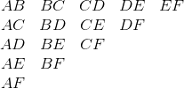
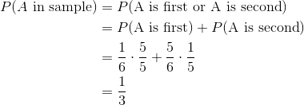
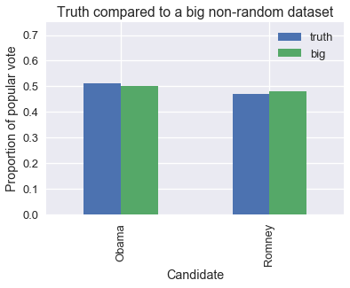
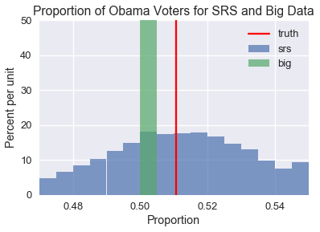

# 二、数据生成

> 原文：[DS-100/textbook/notebooks/ch02](https://nbviewer.jupyter.org/github/DS-100/textbook/tree/master/notebooks/ch02/)
> 
> 译者：[飞龙](https://github.com/wizardforcel)
> 
> 协议：[CC BY-NC-SA 4.0](http://creativecommons.org/licenses/by-nc-sa/4.0/)
> 
> 自豪地采用[谷歌翻译](https://translate.google.cn/)

数据科学很难成为没有数据的科学。 因此重要的是，我们通过了解我们的数据是如何生成的，来启动任何数据分析。

在本章中，我们将讨论数据来源。 虽然术语“数据来源”通常指的是数据的整个历史，以及它随时间变化的位置，但我们将在本教科书中使用这个术语，来指代我们的数据的生成过程。 许多人得出了不成熟的结论，因为他们对数据的理解不够细致; 我们将讨论一个例子来证明，概率抽样在数据科学中的重要性。

## Dewey 击败了 Truman

在 1948 年的美国总统大选中，纽约州州长托马斯杜威（Thomas Dewey）与现任的杜鲁门（Harry Truman）竞争。 像往常一样，一些投票机构进行民意调查，来预测哪个候选人更有可能赢得选举。

### 1936 年：以前的民意调查灾难

在 1936 年，1948 年的三次选举之前，《文学文摘》（Literary Digest）预言，富兰克林·德拉诺·罗斯福会遇到断崖式下跌，这使其声名狼藉。为了做出这个断言，该杂志根据电话和车管局调查了 200 多万人的样本。 你可能知道，这种抽样方案存在抽样偏差：那些拥有电话和汽车的人往往比没有的人更富有。 在这种情况下，抽样偏差如此之大，足以使《文学文摘》认为罗斯福只有 43% 的大众选票，而他最终以 61% 的大众选票胜出，相差近 20%，这是有史以来，由民意调查引发的最大的错误。“文学文摘”不久之后就停刊了 [1]。

> [1] <https://www.qualtrics.com/blog/the-1936-election-a-polling-catastrophe/>

### 1948 年：盖洛普（Gallup）民意调查

为了从过去的错误中学习，盖洛普民意调查采用了一种称为配额抽样的方法，来预测 1948 年选举的结果。 在他们的抽样方案中，每位采访者都会调查来自每个特征类别的一定数量的人。 例如，采访者需要采访不同年龄，种族和收入水平的男性和女性，来匹配美国人口普查的人口特征。 这确保了民意调查不会遗漏投票人群的重要子分组。

使用这种方法，盖洛普民意调查预测，托马斯杜威将比哈里杜鲁门多赢得 5% 的大众选票。 这种差异非常显着，众所周知，《芝加哥论坛报》（ Chicago Tribune）的标题是“杜威击败杜鲁门”：


### 配额抽样的问题

虽然配额抽样确实有助于民意调查者减少抽样偏差，但它以另一种方式引入了偏差。盖洛普民意调查机构对其采访者说，只要他们实现了配额，他们就可以采访他们想要的任何人。为什么采访者的投票结果与共和党人不成比例，以下是一个可能的解释：当时，共和党人平均较富裕，而且更有可能居住在较好的社区，这使他们更容易受到采访。盖洛普民意调查预测的共和党票数，将比之前的 3 次选举的实际结果多出 2 % 至 6%。

这些例子强调了在数据收集过程中，尽可能理解抽样偏差的重要性。《文学文摘》和盖洛普民意调查都错误地认为，当他们的抽样方案始终基于人类判断时，他们的方法是没有偏差的。

我们现在依靠概率抽样，一组抽样方法，为每个样本的外观赋予精确的概率，来尽可能减少数据收集过程中的偏差。

### 大数据？

在大数据时代，我们试图通过收集更多数据来应对偏差。 毕竟，我们知道人口普查会向我们提供完美的估计；不管抽样技术如何，一个非常大的样本不应该给出几乎完美的估计值嘛？

在讨论概率抽样方法来比较两种方法之后，我们将回到这个问题。

## 概率抽样

与任意抽样不同，概率抽样允许我们，为抽取特定样本的事件分配精确的概率。 我们将首先回顾 Data8 中的简单随机样本，然后介绍概率抽样的两种替代方法：整群抽样和分层抽样。

假设我们有 6 个个体。 我们已经给了每个个体一封  的信。

### 简单随机抽样

从这个总体中抽取大小为 2  的简单随机样本，我们可以在单个索引卡片上写下  的每个字母，将所有卡片放入一个帽子中，充分混合这些卡片，然后抽出两张卡片而不看它们。 也就是说，SRS 是无放回随机抽样。

这里是所有可能的大小为 2 的样本：



我们的大小为 6 的总体，有 15 非可能的样本，大小 2。 计算可能的样本数量的另一种方法是：


由于在 SRS 中我们随机均匀抽样，这些 15 非样本中的每个都是等可能选中的：


我们也可以使用这种几率机制，来回答样本组成的其他问题。 例如：


根据对称性，我们可以说：


另一种计算  的方法是，确认对于样本中的 ，我们需要将其作为第一个弹子或第二个弹子来抽取。



### 整群抽样

在整群抽样中，我们将总体划分为簇。 然后，我们使用 SRS 来随机选择簇而不是个体。

作为一个例子，假设我们从大小为 6 的总体选取个体，我们将他们中的每一个配对：，组成 3 个个体为 2 的簇。 然后，我们使用 SRS 选择一个簇来产生大小为 2 的样本。

和以前一样，我们可以计算  在我们样本中的概率：


与之类似，任何特定个体出现在我们的样本中的概率是 。 请注意，这与我们的 SRS 相同。 然而，当我们观察样本本身时，我们看到了差异。 例如，在 SRS 中获得  的机会与获得  的机会相同，都是 。 但是，采用这种整群抽样方案：


由于如果我们只选择一个簇， 和  永远不会出现在同一个样本中。

整群抽样仍然是抽率采样，因为我们可以为每个潜在的抽样分配一个概率。 然而，所得概率与使用 SRS 不同，取决于总体如何聚集。

为什么使用整群抽样？ 整群抽样是最有用的，因为它使得样本收集更容易。 例如，调查 100 个城镇的人口比调查遍布整个美国的数千人要容易得多。 这就是今天许多民意调查机构使用整群抽样形式进行调查的原因。

整群抽样的主要缺点是，它往往会产生更大的估计差异。 这通常意味着，我们在使用整群抽样时需要更大的样本。 请注意，现实比这更复杂，但我们将把细节留给未来的抽样技术课程。

### 分层抽样

在分层抽样中，我们将总体分成几层，然后每层产生一个简单随机样本。 在整群抽样和分层抽样中，我们将人口分成几组；在整群抽样中，我们使用单个 SRS 来选择组，而在分层抽样中，我们使用多个 SRS，每组有一个 SRS。

我们可以将我们大小为 6 的总体分成以下几层：


我们使用 SRS 从每一层中选择一个个体，来生成一个大小为 2 的样本。这向我们提供了以下可能的样本：


再次，我们可以计算  在我们样本中的概率：


但是：


因为  和  不能出现在同一个样本中。

与整群抽样一样，分层抽样也是一种概率抽样方法，它根据总体的分层情况产生不同的概率。 请注意，就像这个例子，层的大小不一定相同。 例如，我们可以根据职业对美国进行分层，然后根据美国职业分布，从每个层级抽取样本 - 如果美国只有 0.01% 的人是统计人员，我们可以确保我们样本的 0.01% 将由统计人员组成。 简单的随机样本可能完全忽略了可怜的统计人员！

你可能已经想到，分层抽样可能被称为配额抽样的合理方式。 它允许研究人员确保总体中的子组，在样本中得到很好的代表，而不用人为判断来选择样本中的个体。 这通常会使估计差异较小。 然而，分层抽样有时更难完成，因为我们有时不知道每一层有多大。 在前面的例子中，我们有美国人口普查的优势，但有些时候我们并不那么幸运。

### 为什么是概率抽样？

我们在 Data8 中看到，概率抽样使我们能够量化，我们对估计或预测的不确定性。 只有通过这个精确度，我们才能进行推断和假设检验。 当任何人向你给出 p 值或置信度，而没有正确解释他们的抽样技术时，要小心。

现在我们理解了概率抽样，让我们看看卑微的 SRS 与“大数据”相比如何。

## SRS vs “大数据”

我们之前提到，通过使用大量数据来消除我们冗长的偏差问题，是很有吸引人的。按照定义，人口普查确实会产生无偏估计。如果我们收集大量数据，也许我们不必担心偏差。

假设我们是 2012 年的民意调查者，试图预测美国总统选举的大众投票，巴拉克·奥巴马与米特​​·罗姆尼竞争。由于我们知道准确的大众投票结果，因此我们可以比较 SRS 的预测，与大型非随机数据集（通常称为行政数据集）的预测，因为它们通常作为某些行政工作的一部分而收集。

我们将比较大小为 400 的 SRS 和大小为 60,000,000 的非随机样本。我们的非随机样本比我们的 SRS 大近 15 万倍！由于 2012 年大约有 1.2 亿选民，我们可以将我们的非随机样本看作一个调查，其中美国所有选民的一半做出了回应（没有超过 10,000,000 个选民的实际调查）。

```py
# HIDDEN
total = 129085410
obama_true_count = 65915795
romney_true_count = 60933504
obama_true = obama_true_count / total
romney_true = romney_true_count / total

# 1 percent off
obama_big = obama_true - 0.01
romney_big = romney_true + 0.01
```

这是一个绘图，比较了非随机样本的比例与真实比例。 标有真实值的条形显示了，每位候选人收到的选票的真实比例。 标有“大”的条形显示了，我们 6000 万选民的数据集中的比例。

```py
pd.DataFrame({
    'truth': [obama_true, romney_true],
    'big': [obama_big, romney_big],
}, index=['Obama', 'Romney'], columns=['truth', 'big']).plot.bar()
plt.title('Truth compared to a big non-random dataset')
plt.xlabel('Candidate')
plt.ylabel('Proportion of popular vote')
plt.ylim(0, 0.75)
None
```



我们可以看到，就像 1948 年的盖洛普民意调查一样，我们的大数据集仅仅有点偏向共和党候选人罗姆尼。尽管如此，这个数据集可以向我们提供准确的预测。 为了检查，我们可以从总体中模拟抽取大小为 400 的随机样本，和大小为 60,000,000 的大型非随机样本。 我们将计算每个样本中的奥巴马的选票比例，并绘制比例分布图。

```py
srs_size = 400
big_size = 60000000
replications = 10000

def resample(size, prop, replications):
    return np.random.binomial(n=size, p=prop, size=replications) / size

srs_simulations = resample(srs_size, obama_true, replications)
big_simulations = resample(big_size, obama_big, replications)
```

现在，我们将绘制模拟结果并放上一条红线，表示投票给奥巴马的选民的真实比例。

```py
bins = bins=np.arange(0.47, 0.55, 0.005)
plt.hist(srs_simulations, bins=bins, alpha=0.7, normed=True, label='srs')
plt.hist(big_simulations, bins=bins, alpha=0.7, normed=True, label='big')

plt.title('Proportion of Obama Voters for SRS and Big Data')
plt.xlabel('Proportion')
plt.ylabel('Percent per unit')
plt.xlim(0.47, 0.55)
plt.ylim(0, 50)
plt.axvline(x=obama_true, color='r', label='truth')
plt.legend()
None
```



正如你所看到的，SRS 分布是分散的，但围绕着奥巴马选民的真实总体比例。 另一方面，大型非随机样本创建的分布非常狭窄，但没有一个模拟样本能够产生真实总体比例。 如果我们尝试使用非随机样本创建置信区间，则它们都不会包含真实总体比例。 更糟糕的是，由于样本非常大，置信区间将非常狭窄。我们最终会确信错误估计。

事实上，当我们的抽样方法有偏差时，由于我们收集了更多的数据，我们的估计会变得更糟，因为我们会更加确信不正确的结果，只有当我们的数据集几乎是人口普查时才会变得更加准确。 数据的质量比它的大小重要得多。

### 重要结论

在接受数据分析结果之前，仔细检查数据的质量是值得的。 特别是，我们必须提出以下问题：

数据是否为人口普查（是否包括整个人群）？ 如果是这样，我们可以直接计算总体的属性而不必使用推断。
如果数据是样本，那么样本是如何收集的？ 为了正确进行推断，样本应该根据概率抽样方法收集。
在产生结果之前对数据进行了哪些更改？ 这些变化是否会影响数据的质量？

对于随机和非随机大样本之间的比较的更多细节，我们建议观看[统计学家 Xiao-Li Meng 的这个讲座](https://www.youtube.com/watch?v=yz3jOIHLYhU)。
