# 六、数据可视化

> 图表中有一种魔力。曲线的轮廓瞬间揭示出整体情况 - 流行病，恐慌或繁荣时代的历史。 曲线将信息传给大脑，激活想象力，并具有说服力。
> 
> Henry D. Hubbard

数据可视化是数据科学的每个分析步骤的必不可少的工具，从数据清理，到 EDA，到传达结论和预测。 由于人类的大脑的视觉感知高度发达，精心挑选的绘图往往比文本描述更有效地揭示数据中的趋势和异常。

为了高效地使用数据可视化，你必须精通编程工具来生成绘图，以及可视化原则。 在本章中，我们将介绍`seaborn`和`matplotlib`，这是我们创建绘图的首选工具。 我们还将学习如何发现误导性的可视化，以及如何使用数据转换，平滑和降维来改善可视化。

## 定量数据

我们通常使用不同类型的图表来可视化定量（数字）数据和定性（序数或标称）数据。

对于定量数据，我们通常使用直方图，箱形图和散点图。

我们可以使用`seaborn`绘图库在 Python 中创建这些图。 我们将使用包含泰坦尼克号上乘客信息的数据集。

```py
# Import seaborn and apply its plotting styles
import seaborn as sns
sns.set()
# Load the dataset and drop N/A values to make plot function calls simpler
ti = sns.load_dataset('titanic').dropna().reset_index(drop=True)

# This table is too large to fit onto a page so we'll output sliders to
# pan through different sections.
df_interact(ti)

# (182 rows, 15 columns) total
```

### 直方图

我们可以看到数据集每行包含一个乘客，包括乘客的年龄和乘客为机票支付的金额。 让我们用直方图来可视化年龄。 我们可以使用`seaborn`的`distplot`函数：

```py
# Adding a semi-colon at the end tells Jupyter not to output the
# usual <matplotlib.axes._subplots.AxesSubplot> line
sns.distplot(ti['age']);
```


默认情况下，`seaborn`的`distplot`函数将输出一个平滑的曲线，大致拟合分布。 我们还可以添加`rug`绘图，在`x`轴上标记每个点：

```py
sns.distplot(ti['age'], rug=True);
```

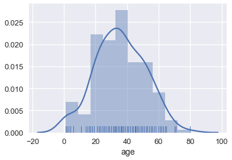

我们也可以绘制分布本身。 调整桶的数量表明船上有许多儿童。

```py
sns.distplot(ti['age'], kde=False, bins=30);
```


### 箱形图

箱形图是查看大部分数据所在位置的便捷方式。 通常，我们使用数据的 25 和 75 百分位数作为箱子的起点和终点，并在箱子内为 50 百分位数（中位数）绘制一条线。 我们绘制两个“胡须”，除了离群点外，它们可以扩展显示剩余数据，离群点数据被标记为胡须外的各个点。

```py
sns.boxplot(x='fare', data=ti);
```

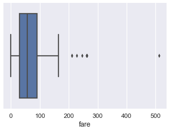

我们通常使用四分位间距（IQR）来确定，哪些点被认为是箱形图的异常值。 IQR 是数据的 75 百分位数与 25 百分位数的差。

```py
lower, upper = np.percentile(ti['fare'], [25, 75])
iqr = upper - lower
iqr

# 60.299999999999997
```

比 75 百分位数大`1.5×IQR`，或者比 25 百分位数小`1.5×IQR`的值，被认为是离群点，我们可以在上面的箱形图中看到，它们被单独标记：

```py
upper_cutoff = upper + 1.5 * iqr
lower_cutoff = lower - 1.5 * iqr
upper_cutoff, lower_cutoff

# (180.44999999999999, -60.749999999999986)
```

虽然直方图一次显示整个分布，但当我们按不同类别分割数据时，箱型图通常更容易理解。 例如，我们可以为每类乘客制作一个箱形图：

```py
sns.boxplot(x='fare', y='who', data=ti);
```


单独的箱形图比下面的重叠直方图更容易理解，它绘制相同数据：

```py
sns.distplot(ti.loc[ti['who'] == 'woman', 'fare'])
sns.distplot(ti.loc[ti['who'] == 'man', 'fare'])
sns.distplot(ti.loc[ti['who'] == 'child', 'fare']);
```


### 使用 Seaborn 的简要注解

你可能已经注意到，为`who`列创建单个箱形图的`boxplot`调用，比制作叠加直方图的等效代码更简单。 虽然`sns.distplot`接受数据数组或序列，但大多数其他`seaborn`函数允许你传入一个`DataFrame`，并指定在`x`和`y`轴上绘制哪一列。 例如：

```py
# Plots the `fare` column of the `ti` DF on the x-axis
sns.boxplot(x='fare', data=ti);
```

当列是类别的时候（`'who'`列包含`'woman'`，`'man'`和`'child'`），`seaborn`会在绘图之前自动按照类别分割数据。 这意味着，我们不必像我们为`sns.distplot`所做的那样，自己过滤掉每个类别。

```py
# fare (numerical) on the x-axis,
# who (nominal) on the y-axis
sns.boxplot(x='fare', y='who', data=ti);
```


### 散点图

散点图用于比较两个定量变量。 我们可以使用散点图比较泰坦尼克号数据集的年龄和票价列。

```py
sns.lmplot(x='age', y='fare', data=ti);
```

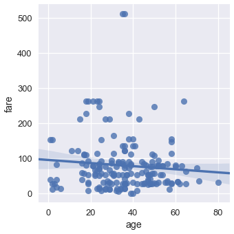

默认情况下，`seaborn`也会使回归直线拟合我们的散点图，并自举散点图，在回归线周围创建 95% 置信区间，如上图中的浅蓝色阴影所示。 这里，回归线似乎不太适合散点图，所以我们可以关闭回归。

```py
sns.lmplot(x='age', y='fare', data=ti, fit_reg=False);
```

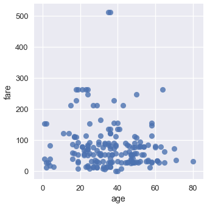

我们可以使用类别变量对点进行着色。 让我们再次使用`who`列：

```py
sns.lmplot(x='age', y='fare', hue='who', data=ti, fit_reg=False);
```

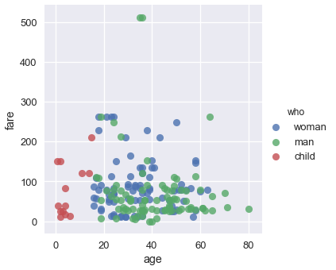

我们可以从这个图中看出，所有年龄在 18 岁左右的乘客都标记为小孩。 虽然两张最贵的门票是男性购买的，但男女乘客票价似乎没有明显的差异。

## 定性数据

对于定性或类别数据，我们通常使用条形图和点图。 我们将展示，如何使用`seaborn`和泰坦尼克号幸存者数据集创建这些绘图。

```py
# Import seaborn and apply its plotting styles
import seaborn as sns
sns.set()

# Load the dataset
ti = sns.load_dataset('titanic').reset_index(drop=True)

# This table is too large to fit onto a page so we'll output sliders to
# pan through different sections.
df_interact(ti)

# (891 rows, 15 columns) total
```

### 条形图

在`seaborn`中，有两种类型的条形图。 第一种使用`countplot`方法来计算每个类别在列中出现的次数。

```py
# Counts how many passengers survived and didn't survive and
# draws bars with corresponding heights
sns.countplot(x='alive', data=ti);
```

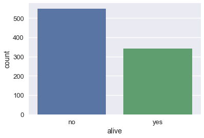

```py
sns.countplot(x='class', data=ti);
```


```py
# As with box plots, we can break down each category further using color
sns.countplot(x='alive', hue='class', data=ti);
```


另一方面，`barplot`方法按照类别列对`DataFrame`进行分组，并根据每个组内的数字列的平均值绘制条的高度。

```py
# For each set of alive/not alive passengers, compute and plot the average age.
sns.barplot(x='alive', y='age', data=ti);
```

通过对原始`DataFrame`进行分组，并计算年龄列的平均值，可以计算每个条形的高度：

```py
ti[['alive', 'age']].groupby('alive').mean()
```


| | age |
| --- | --- |
| alive |  |
| no | 30.626179 |
| yes | 28.343690 |

默认情况下，`barplot`方法也会为每个平均值，计算自举的 95% 置信区间，在上面的条形图中标记为黑线。 置信区间表明，如果数据集包含泰坦尼克号乘客的随机样本，那么在 5% 的显着性水平下，幸存者和死亡者的年龄差异无统计学意义。

当我们有更大的数据集时，这些置信区间需要很长的时间才能生成，因此有时会关闭它们：

```py
sns.barplot(x='alive', y='age', data=ti, ci=False);
```


### 点图

点图与条形图类似。 它不是绘制条形图，而是标记条形图末尾处的单个点。 我们使用`pointplot`方法在`seaborn`中制作点图。 与`barplot`方法一样，`pointplot`方法也自动将`DataFrame`分组，并计算每组数值变量的平均值，将 95% 置信区间标记为以每个点为中心的垂直线。

```py
# For each set of alive/not alive passengers, compute and plot the average age.
sns.pointplot(x='alive', y='age', data=ti);
```

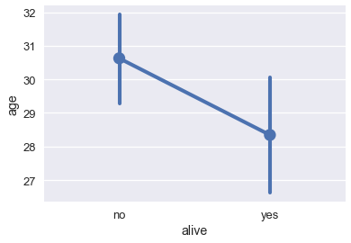

比较跨类别的变化时，点图非常有用：

```py
# Shows the proportion of survivors for each passenger class
sns.pointplot(x='class', y='survived', data=ti);
```

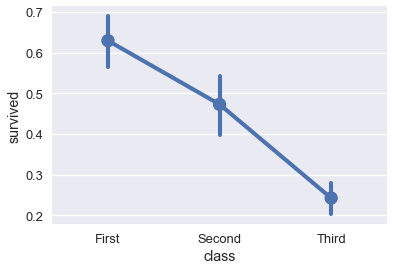

```py
# Shows the proportion of survivors for each passenger class,
# split by whether the passenger was an adult male
sns.pointplot(x='class', y='survived', hue='adult_male', data=ti);
```


## 使用`matplotlib`定制绘图

尽管`seaborn`能让我们快速创建多种类型的绘图，但它并不能让我们细致地控制图表。 例如，我们不能使用`seaborn`来修改绘图的标题，更改`x`或`y`轴标签，或将注释添加到绘图。 相反，我们必须使用`seaborn`所基于的`matplotlib`库。

`matplotlib`提供了基本的积木，用于在 Python 中创建绘图。 虽然它提供了很好的控制权，但它也更加麻烦 - 使用`matplotlib`重新创建之前章节中的`seaborn`绘图需要多行代码。 实际上，我们可以将`seaborn`视为一组有用的快捷方式，用于创建`matplotlib`绘图。 尽管我们更喜欢在`seaborn`中创建绘图的原型，但为了定制绘图以便发布，我们需要学习`matplotlib`的基本部分。

在我们查看第一个简单示例之前，我们必须在笔记本中开启`matplotlib`支持：

```py
# This line allows matplotlib plots to appear as images in the notebook
# instead of in a separate window.
%matplotlib inline

# plt is a commonly used shortcut for matplotlib
import matplotlib.pyplot as plt
```

### 定制图表和轴域

为了在`matplotlib`中创建绘图，我们创建图形（Figure），然后在图形中添加一个轴域（Axes）。 在`matplotlib`中，轴域是单个图表，而图形可以在一个表格布局中包含多个轴域。 轴域包含标记，图上绘制的线或补丁。

```py
# Create a figure
f = plt.figure()

# Add an axes to the figure. The second and third arguments create a table
# with 1 row and 1 column. The first argument places the axes in the first
# cell of the table.
ax = f.add_subplot(1, 1, 1)

# Create a line plot on the axes
ax.plot([0, 1, 2, 3], [1, 3, 4, 3])

# Show the plot. This will automatically get called in a Jupyter notebook
# so we'll omit it in future cells
plt.show()
```

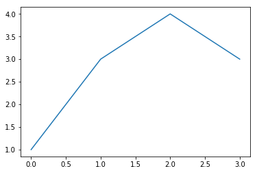

为了自定义绘图，我们可以在轴域对象上使用其他方法：

```py
f = plt.figure()
ax = f.add_subplot(1, 1, 1)

x = np.arange(0, 10, 0.1)

# Setting the label kwarg lets us generate a legend
ax.plot(x, np.sin(x), label='sin(x)')
ax.plot(x, np.cos(x), label='cos(x)')
ax.legend()

ax.set_title('Sinusoids')
ax.set_xlabel('x')
ax.set_ylabel('y');
```

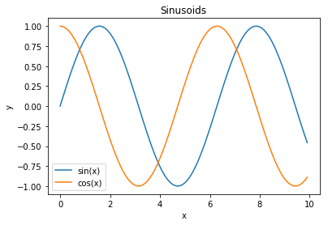

作为一种捷径，`matplotlib`在`plt`模块上提供了绘制方法，会自动初始化图形和轴域。

```py
# Shorthand to create figure and axes and call ax.plot
plt.plot(x, np.sin(x))

# When plt methods are called multiple times in the same cell, the
# existing figure and axes are reused.
plt.scatter(x, np.cos(x));
```

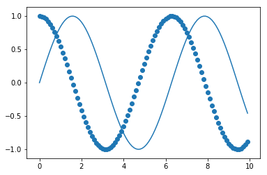

`plt`模块的方法与轴域相似，因此我们可以使用`plt`捷径重新创建其中一个上述的图。

```py
x = np.arange(0, 10, 0.1)

plt.plot(x, np.sin(x), label='sin(x)')
plt.plot(x, np.cos(x), label='cos(x)')
plt.legend()

# Shorthand for ax.set_title
plt.title('Sinusoids')
plt.xlabel('x')
plt.ylabel('y')

# Set the x and y-axis limits
plt.xlim(-1, 11)
plt.ylim(-1.2, 1.2);
```

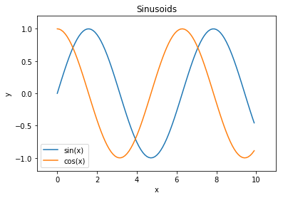

### 定制标记

为了改变绘图标记本身的属性（例如上图中的线），我们可以将其他参数传递给`plt.plot`。

```py
additional arguments into plt.plot.

plt.plot(x, np.sin(x), linestyle='--', color='purple');
```

查看`matplotlib`文档，是找出哪些参数可用于每种方法的最简单方法。 另一种方法是存储返回的线条对象：

```py
In [1]: line, = plot([1,2,3])
```

这些线条对象有许多可以控制的属性，下面是在 IPython 中使用 Tab 补全的完整列表：

```
In [2]: line.set
line.set                     line.set_drawstyle           line.set_mec
line.set_aa                  line.set_figure              line.set_mew
line.set_agg_filter          line.set_fillstyle           line.set_mfc
line.set_alpha               line.set_gid                 line.set_mfcalt
line.set_animated            line.set_label               line.set_ms
line.set_antialiased         line.set_linestyle           line.set_picker
line.set_axes                line.set_linewidth           line.set_pickradius
line.set_c                   line.set_lod                 line.set_rasterized
line.set_clip_box            line.set_ls                  line.set_snap
line.set_clip_on             line.set_lw                  line.set_solid_capstyle
line.set_clip_path           line.set_marker              line.set_solid_joinstyle
line.set_color               line.set_markeredgecolor     line.set_transform
line.set_contains            line.set_markeredgewidth     line.set_url
line.set_dash_capstyle       line.set_markerfacecolor     line.set_visible
line.set_dashes              line.set_markerfacecoloralt  line.set_xdata
line.set_dash_joinstyle      line.set_markersize          line.set_ydata
line.set_data                line.set_markevery           line.set_zorder
```

但是`setp`调用（设置属性的缩写）可能非常有用，尤其是在交互式工作时，因为它支持自检，所以你可以在工作时了解有效的调用：

```
In [7]: line, = plot([1,2,3])

In [8]: setp(line, 'linestyle')
  linestyle: [ ``'-'`` | ``'--'`` | ``'-.'`` | ``':'`` | ``'None'`` | ``' '`` | ``''`` ]         and any drawstyle in combination with a linestyle, e.g. ``'steps--'``.         

In [9]: setp(line)
  agg_filter: unknown
  alpha: float (0.0 transparent through 1.0 opaque)         
  animated: [True | False]         
  antialiased or aa: [True | False]
  ...
  ... much more output omitted
  ...
```

在第一种形式中，它向你显示`'linestyle'`属性的有效值，并在第二种形式中向你显示，可以在线条对象上设置的所有可接受属性。 这使得你可以轻松发现，如何定制图形来获得你所需的视觉效果。

### 任意文本和 LaTeX 支持

在`matplotlib`中，可以相对于单独的轴对象或整个图形添加文本。

这些命令将文本添加到轴域：

+   `set_title()` - 添加标题
+   `set_xlabel()` - 向 x 轴添加轴标签
+   `set_ylabel()` - 向 y 轴添加轴标签
+   `text()` - 在任意位置添加文本
+   `annotate()` - 添加注解，带有可选的箭头

以及这些作用于整个图形：

+   `figtext()` - 在任意位置添加文本
+   `suptitle()` - 添加标题

并且任何文本字段都可以包含用于数学的 LaTeX 表达式，只要它们包含在`$`符号中即可。

这个例子演示了所有这些：

```py
fig = plt.figure()
fig.suptitle('bold figure suptitle', fontsize=14, fontweight='bold')

ax = fig.add_subplot(1, 1, 1)
fig.subplots_adjust(top=0.85)
ax.set_title('axes title')

ax.set_xlabel('xlabel')
ax.set_ylabel('ylabel')

ax.text(3, 8, 'boxed italics text in data coords', style='italic',
        bbox={'facecolor':'red', 'alpha':0.5, 'pad':10})

ax.text(2, 6, 'an equation: $E=mc^2$', fontsize=15)

ax.text(3, 2, 'unicode: Institut für Festkörperphysik')

ax.text(0.95, 0.01, 'colored text in axes coords',
        verticalalignment='bottom', horizontalalignment='right',
        transform=ax.transAxes,
        color='green', fontsize=15)


ax.plot([2], [1], 'o')
ax.annotate('annotate', xy=(2, 1), xytext=(3, 4),
            arrowprops=dict(facecolor='black', shrink=0.05))

ax.axis([0, 10, 0, 10]);
```

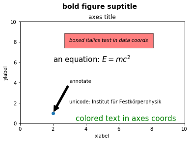

### 使用`matplotlib`定制`seaborn`绘图

既然我们已经看到了如何使用`matplotlib`来定制绘图，我们可以使用相同的方法来定制`seaborn`绘图，因为`seaborn`在背后使用`matplotlib`创建了绘图。

```py
# Load seaborn
import seaborn as sns
sns.set()
sns.set_context('talk')

# Load dataset
ti = sns.load_dataset('titanic').dropna().reset_index(drop=True)
ti.head()
```


| | survived | pclass | sex | age | ... | deck | embark_town | alive | alone |
| --- | --- | --- | --- | --- | --- | --- | --- | --- | --- |
| 0 | 1 | 1 | female | 38.0 | ... | C | Cherbourg | yes | False |
| 1 | 1 | 1 | female | 35.0 | ... | C | Southampton | yes | False |
| 2 | 0 | 1 | male | 54.0 | ... | E | Southampton | no | True |
| 3 | 1 | 3 | female | 4.0 | ... | G | Southampton | yes | False |
| 4 | 1 | 1 | female | 58.0 | ... | C | Southampton | yes | True |

5 rows × 15 columns

我们以这个绘图开始：

```py
sns.lmplot(x='age', y='fare', hue='who', data=ti, fit_reg=False);
```


我们可以看到，该图需要标题和更好的`x`和`y`轴标签。 另外，票价最高的两个人幸存了下来，所以我们可以在我们的绘图中注明他们。

```py
sns.lmplot(x='age', y='fare', hue='who', data=ti, fit_reg=False)

plt.title('Fare Paid vs. Age of Passenger, Colored by Passenger Type')
plt.xlabel('Age of Passenger')
plt.ylabel('Fare in USD')

plt.annotate('Both survived', xy=(35, 500), xytext=(35, 420),
             arrowprops=dict(facecolor='black', shrink=0.05));
```

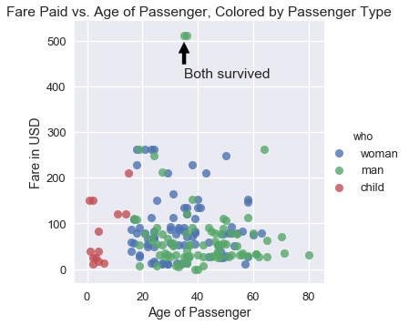

在实践中，我们使用`seaborn`快速探索数据，然后一旦我们决定在论文或展示中使用这些图，转向`matplotlib`以便调优。

## 可视化的原则

现在我们有了创建和更改绘图的工具，现在我们转向数据可视化的关键原则。 与数据科学的其他部分非常相似，很难准确地用一个数字来衡量特定可视化的效率。 尽管如此，还是有一些通用原则，可以使可视化更有效地显示数据趋势。 我们讨论了六类原则：尺度，条件，感知，转换，上下文和平滑。

### 尺度原则

尺度原则与涉及用于绘制数据的`x`和`y`轴的选择。

在 2015 年的美国国会听证会上，Chaffetz 代表讨论了计划生育项目的调查。 他展示了以下绘图，最初出现在美国生命联合会的一篇报告中。 它比较了堕胎和癌症筛查程序的数量，两者都是由计划生育提供的。 （完整报告可在 <https://oversight.house.gov/interactivepage/plannedparenthood> 查阅。）

这个绘图有什么疑点？它绘制了多少个数据点？

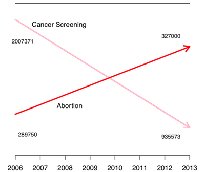

这个绘图违反了尺度原则；它没有很好选择其`x`和`y`轴。

当我们为我们的绘图选择`x`轴和`y`轴时，我们应该在整个轴上保持一致的尺度。 然而，上图用于堕胎和癌症筛查的线条具有不同的尺度 - 堕胎的线条的起点和癌症筛查线条的终点在`y`轴上彼此接近，但代表了大不相同的数字。 此外，仅绘制了 2006 年和 2013 年的点数，但`x`轴包含之间的每年的不必要的刻度线。

为了改善这个绘图，我们应该在相同的`y`轴尺度上重新绘制相同的点：

```py
# HIDDEN
pp = pd.read_csv("data/plannedparenthood.csv")
plt.plot(pp['year'], pp['screening'], linestyle="solid", marker="o", label='Cancer')
plt.plot(pp['year'], pp['abortion'], linestyle="solid", marker="o", label='Abortion')
plt.title('Planned Parenthood Procedures')
plt.xlabel("Year")
plt.ylabel("Service")
plt.xticks([2006, 2013])
plt.legend();
```

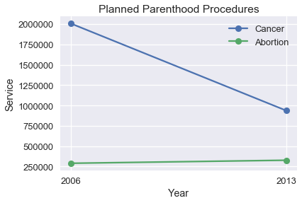

我们可以看到，与癌症筛查数量的大幅下降相比，堕胎数量的变化非常小。 我们可能会对数量变化的百分比感兴趣，而不是过程的数量。

```py
# HIDDEN
percent_change = pd.DataFrame({
    'percent_change': [
        pp['screening'].iloc[1] / pp['screening'].iloc[0] - 1,
        pp['abortion'].iloc[1] / pp['abortion'].iloc[0] - 1,
    ],
    'procedure': ['cancer', 'abortion'],
    'type': ['percent_change', 'percent_change'],
})
ax = sns.barplot(x='procedure', y='percent_change', data=percent_change)
plt.title('Percent Change in Number of Procedures')
plt.xlabel('')
plt.ylabel('Percent Change')
plt.ylim(-0.6, 0.6)
plt.axhline(y=0, c='black');
```

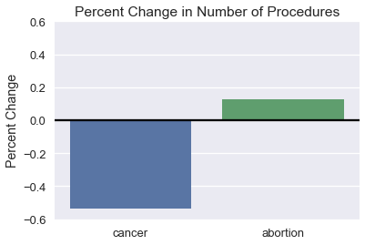

选择`x`轴和`y`轴的限制时，我们倾向于重点关注带有大部分数据的区域，特别是在处理长尾数据时。 考虑以下绘图，它的放大版本在右侧：


右图更有助于理解数据集。 如果需要，我们可以对数据的不同区域绘制多个图，来显示整个数据范围。 在本节的后面，我们讨论数据转换，这也有助于可视化长尾数据。

### 条件原则

条件原则为我们提供了技巧，来展示我们数据的子组之间的分布和关系。

美国劳工统计局负责监督与美国经济健康有关的科学调查。 他们的网站包含一个工具，使用这些数据生成报告。数据用于生成这个图表，它比较了每周收入的中位数，按性别分组。

使用这种绘图，最容易实现哪些比较？ 它们是最有趣或最重要的比较嘛？


这个绘图让我们一眼就看到，随着教育水平提高，每周收入会增加。 然而，很难准确地确定，对于每种教育水平收入增加的程度，在相同的教育水平上，比较男性和女性的每周收入甚至更加困难。 我们可以通过使用点图而不是条形图来发现这两种趋势。

```py
# HIDDEN
cps = pd.read_csv("data/edInc2.csv")
ax = sns.pointplot(x="educ", y="income", hue="gender", data=cps)

ticks = ["<HS", "HS", "<BA", "BA", ">BA"]
ax.set_xticklabels(ticks)
ax.set_xlabel("Education")
ax.set_ylabel("Income")
ax.set_title("2014 Median Weekly Earnings\nFull-Time Workers over 25 years old");
```

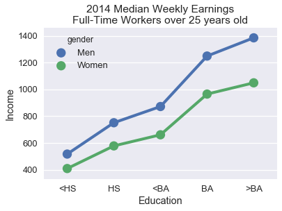

连接点的线条更清晰地表明，本科学位的每周收入相对较大。 将男性和女性的数值直接放在一起，可以更容易地看出，随着教育水平的提高，男性和女性之间的工资差距趋于增加。

为了有助于比较数据中的两个子组，请沿`x`或`y`轴对齐标记，并为不同的子组使用不同的颜色或标记。 线条比条形更倾向于显示数据的趋势，对于序数和数值数据都是有用的选择。

### 感知原则

人类感知具有特定属性，在可视化设计中考虑它们十分重要。 人类感知的第一个重要属性是，比起其它颜色，我们更强烈地感知某些颜色，尤其是绿色。 此外我们认为，较浅的阴影区域比较深的阴影区域大。 例如，在我们刚刚讨论的每周收入图中，较浅的条形似乎比较深的条形吸引更多注意力：


实际上，你应该确保图表的调色板在感知上是统一的。 这意味着，例如，条形图中条形之间的颜色的感知强度不会发生变化。 对于定量数据，你有两种选择：如果你的数据从低到高排列，并且你想强调较大的值，则使用顺序配色方案，将较浅的颜色分配给较大的值。 如果应该强调低值和高值，则使用分色配色方案，将更浓的颜色分配给更接近中心的值。

`seaborn `内置了许多有用的调色板。 你可以浏览其文档来了解如何在调色板之间切换：<http://seaborn.pydata.org/tutorial/color_palettes.html>

人类感知的第二个重要属性是，当我们比较长度时，我们通常更准确，当比较面积时我们更不准确。 考虑下面的非洲国家的 GDP 图。

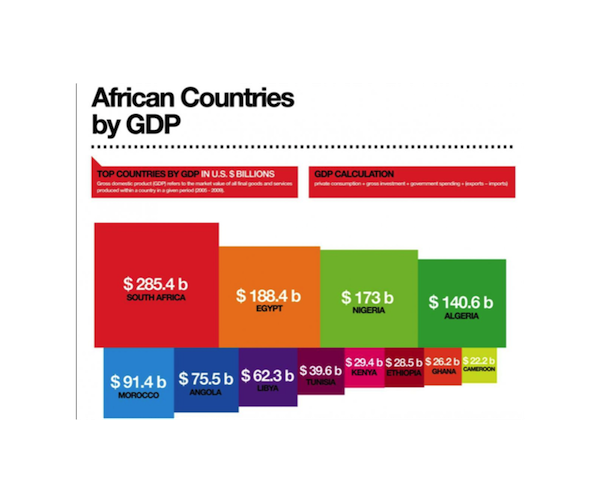

按数值计算，南非的 GDP 是阿尔及利亚的两倍，但从上面的绘图来看并不容易分辨。 相反，我们可以在点图上绘制 GDP：

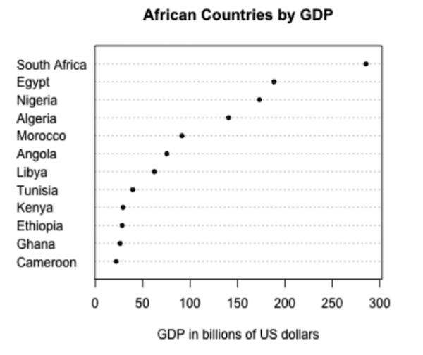

这更清晰，因为它使我们能够比较长度而不是面积。出于相同的原因，饼图和三维图很难解释；我们倾向于在实践中避免使用这些图表。

人类感知的第三个也是最后一个属性是，人眼在改变基线方面存在困难。 考虑以下的层叠面积图，绘制随时间变化的二氧化碳排放量，按国家分组。

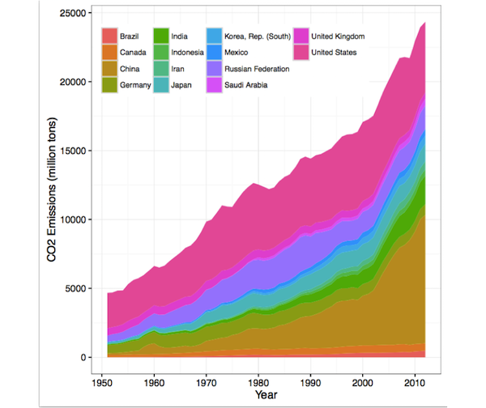

观察英国的排放量随时间增加或减少是很困难的，由于基线摆动问题：该面积的基线上下摆动。 当两个高度相似时（例如 2000 年），英国的排放量是否大于中国的排放量，也难以比较。

层叠条形图中出现类似的基线摆动问题。 在下面的图中，很难比较德国和墨西哥的 15-64 岁的人数。


我们通常可以通过切换为折线图，来改善层叠面积或条形图。 以下是随时间变化的排放量数据，绘制成线条而不是面积：

```py
# HIDDEN
co2 = pd.read_csv("data/CAITcountryCO2.csv", skiprows = 2,
                  names = ["Country", "Year", "CO2"])
last_year = co2.Year.iloc[-1]
q = f"Country != 'World' and Country != 'European Union (15)' and Year == {last_year}"
top14_lasty = co2.query(q).sort_values('CO2', ascending=False).iloc[:14]
top14 = co2[co2.Country.isin(top14_lasty.Country) & (co2.Year >= 1950)]

from cycler import cycler

linestyles = (['-', '--', ':', '-.']*3)[:7]
colors = sns.color_palette('colorblind')[:4]
lines_c = cycler('linestyle', linestyles)
color_c = cycler('color', colors)

fig, ax = plt.subplots(figsize=(9, 9))
ax.set_prop_cycle(lines_c * color_c)

x, y ='Year', 'CO2'
for name, df in top14.groupby('Country'):
    ax.semilogy(df[x], df[y], label=name)

ax.set_xlabel(x)
ax.set_ylabel(y + "Emissions [Million Tons]")
ax.legend(ncol=2, frameon=True);
```

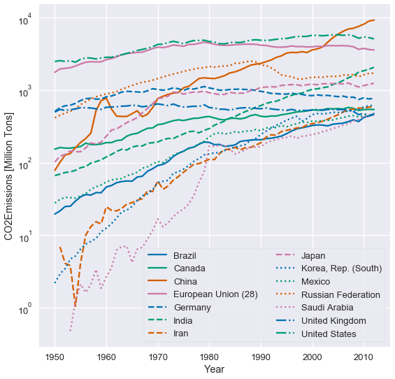

这个绘图并不会改动基线，因此比较国家间的排放量更容易。 我们也可以更清楚地看到，哪些国家的排放量增加最多。
