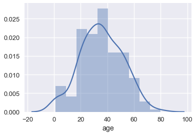
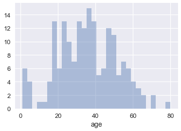
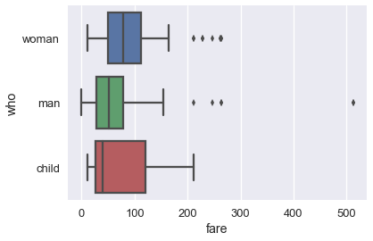
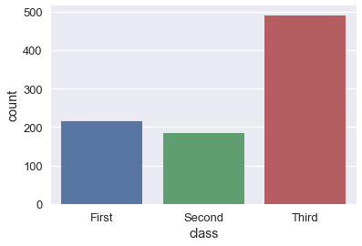
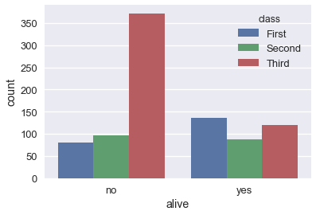
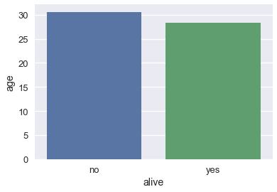
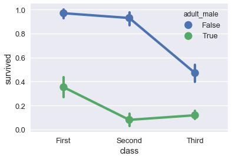

# 六、数据可视化

> 图表中有一种魔力。曲线的轮廓瞬间揭示出整体情况 - 流行病，恐慌或繁荣时代的历史。 曲线将信息传给大脑，激活想象力，并具有说服力。
> 
> Henry D. Hubbard

数据可视化是数据科学的每个分析步骤的必不可少的工具，从数据清理，到 EDA，到传达结论和预测。 由于人类的大脑的视觉感知高度发达，精心挑选的绘图往往比文本描述更有效地揭示数据中的趋势和异常。

为了高效地使用数据可视化，你必须精通编程工具来生成绘图，以及可视化原则。 在本章中，我们将介绍`seaborn`和`matplotlib`，这是我们创建绘图的首选工具。 我们还将学习如何发现误导性的可视化，以及如何使用数据转换，平滑和降维来改善可视化。

## 定量数据

我们通常使用不同类型的图表来可视化定量（数字）数据和定性（序数或标称）数据。

对于定量数据，我们通常使用直方图，箱形图和散点图。

我们可以使用`seaborn`绘图库在 Python 中创建这些图。 我们将使用包含泰坦尼克号上乘客信息的数据集。

```py
# Import seaborn and apply its plotting styles
import seaborn as sns
sns.set()
# Load the dataset and drop N/A values to make plot function calls simpler
ti = sns.load_dataset('titanic').dropna().reset_index(drop=True)

# This table is too large to fit onto a page so we'll output sliders to
# pan through different sections.
df_interact(ti)

# (182 rows, 15 columns) total
```

### 直方图

我们可以看到数据集每行包含一个乘客，包括乘客的年龄和乘客为机票支付的金额。 让我们用直方图来可视化年龄。 我们可以使用`seaborn`的`distplot`函数：

```py
# Adding a semi-colon at the end tells Jupyter not to output the
# usual <matplotlib.axes._subplots.AxesSubplot> line
sns.distplot(ti['age']);
```



默认情况下，`seaborn`的`distplot`函数将输出一个平滑的曲线，大致拟合分布。 我们还可以添加`rug`绘图，在`x`轴上标记每个点：

```py
sns.distplot(ti['age'], rug=True);
```


我们也可以绘制分布本身。 调整桶的数量表明船上有许多儿童。

```py
sns.distplot(ti['age'], kde=False, bins=30);
```



### 箱形图

箱形图是查看大部分数据所在位置的便捷方式。 通常，我们使用数据的 25 和 75 百分位数作为箱子的起点和终点，并在箱子内为 50 百分位数（中位数）绘制一条线。 我们绘制两个“胡须”，除了离群点外，它们可以扩展显示剩余数据，离群点数据被标记为胡须外的各个点。

```py
sns.boxplot(x='fare', data=ti);
```


我们通常使用四分位间距（IQR）来确定，哪些点被认为是箱形图的异常值。 IQR 是数据的 75 百分位数与 25 百分位数的差。

```py
lower, upper = np.percentile(ti['fare'], [25, 75])
iqr = upper - lower
iqr

# 60.299999999999997
```

比 75 百分位数大`1.5×IQR`，或者比 25 百分位数小`1.5×IQR`的值，被认为是离群点，我们可以在上面的箱形图中看到，它们被单独标记：

```py
upper_cutoff = upper + 1.5 * iqr
lower_cutoff = lower - 1.5 * iqr
upper_cutoff, lower_cutoff

# (180.44999999999999, -60.749999999999986)
```

虽然直方图一次显示整个分布，但当我们按不同类别分割数据时，箱型图通常更容易理解。 例如，我们可以为每类乘客制作一个箱形图：

```py
sns.boxplot(x='fare', y='who', data=ti);
```


单独的箱形图比下面的重叠直方图更容易理解，它绘制相同数据：

```py
sns.distplot(ti.loc[ti['who'] == 'woman', 'fare'])
sns.distplot(ti.loc[ti['who'] == 'man', 'fare'])
sns.distplot(ti.loc[ti['who'] == 'child', 'fare']);
```


### 使用 Seaborn 的简要注解

你可能已经注意到，为`who`列创建单个箱形图的`boxplot`调用，比制作叠加直方图的等效代码更简单。 虽然`sns.distplot`接受数据数组或序列，但大多数其他`seaborn`函数允许你传入一个`DataFrame`，并指定在`x`和`y`轴上绘制哪一列。 例如：

```py
# Plots the `fare` column of the `ti` DF on the x-axis
sns.boxplot(x='fare', data=ti);
```

当列是类别的时候（`'who'`列包含`'woman'`，`'man'`和`'child'`），`seaborn`会在绘图之前自动按照类别分割数据。 这意味着，我们不必像我们为`sns.distplot`所做的那样，自己过滤掉每个类别。

```py
# fare (numerical) on the x-axis,
# who (nominal) on the y-axis
sns.boxplot(x='fare', y='who', data=ti);
```



### 散点图

散点图用于比较两个定量变量。 我们可以使用散点图比较泰坦尼克号数据集的年龄和票价列。

```py
sns.lmplot(x='age', y='fare', data=ti);
```


默认情况下，`seaborn`也会使回归直线拟合我们的散点图，并自举散点图，在回归线周围创建 95% 置信区间，如上图中的浅蓝色阴影所示。 这里，回归线似乎不太适合散点图，所以我们可以关闭回归。

```py
sns.lmplot(x='age', y='fare', data=ti, fit_reg=False);
```


我们可以使用类别变量对点进行着色。 让我们再次使用`who`列：

```py
sns.lmplot(x='age', y='fare', hue='who', data=ti, fit_reg=False);
```


我们可以从这个图中看出，所有年龄在 18 岁左右的乘客都标记为小孩。 虽然两张最贵的门票是男性购买的，但男女乘客票价似乎没有明显的差异。

## 定性数据

对于定性或类别数据，我们通常使用条形图和点图。 我们将展示，如何使用`seaborn`和泰坦尼克号幸存者数据集创建这些绘图。

```py
# Import seaborn and apply its plotting styles
import seaborn as sns
sns.set()

# Load the dataset
ti = sns.load_dataset('titanic').reset_index(drop=True)

# This table is too large to fit onto a page so we'll output sliders to
# pan through different sections.
df_interact(ti)

# (891 rows, 15 columns) total
```

### 条形图

在`seaborn`中，有两种类型的条形图。 第一种使用`countplot`方法来计算每个类别在列中出现的次数。

```py
# Counts how many passengers survived and didn't survive and
# draws bars with corresponding heights
sns.countplot(x='alive', data=ti);
```


```py
sns.countplot(x='class', data=ti);
```



```py
# As with box plots, we can break down each category further using color
sns.countplot(x='alive', hue='class', data=ti);
```



另一方面，`barplot`方法按照类别列对`DataFrame`进行分组，并根据每个组内的数字列的平均值绘制条的高度。

```py
# For each set of alive/not alive passengers, compute and plot the average age.
sns.barplot(x='alive', y='age', data=ti);
```

通过对原始`DataFrame`进行分组，并计算年龄列的平均值，可以计算每个条形的高度：

```py
ti[['alive', 'age']].groupby('alive').mean()
```


| | age |
| --- | --- |
| alive |  |
| no | 30.626179 |
| yes | 28.343690 |

默认情况下，`barplot`方法也会为每个平均值，计算自举的 95% 置信区间，在上面的条形图中标记为黑线。 置信区间表明，如果数据集包含泰坦尼克号乘客的随机样本，那么在 5% 的显着性水平下，幸存者和死亡者的年龄差异无统计学意义。

当我们有更大的数据集时，这些置信区间需要很长的时间才能生成，因此有时会关闭它们：

```py
sns.barplot(x='alive', y='age', data=ti, ci=False);
```



### 点图

点图与条形图类似。 它不是绘制条形图，而是标记条形图末尾处的单个点。 我们使用`pointplot`方法在`seaborn`中制作点图。 与`barplot`方法一样，`pointplot`方法也自动将`DataFrame`分组，并计算每组数值变量的平均值，将 95% 置信区间标记为以每个点为中心的垂直线。

```py
# For each set of alive/not alive passengers, compute and plot the average age.
sns.pointplot(x='alive', y='age', data=ti);
```


比较跨类别的变化时，点图非常有用：

```py
# Shows the proportion of survivors for each passenger class
sns.pointplot(x='class', y='survived', data=ti);
```


```py
# Shows the proportion of survivors for each passenger class,
# split by whether the passenger was an adult male
sns.pointplot(x='class', y='survived', hue='adult_male', data=ti);
```


